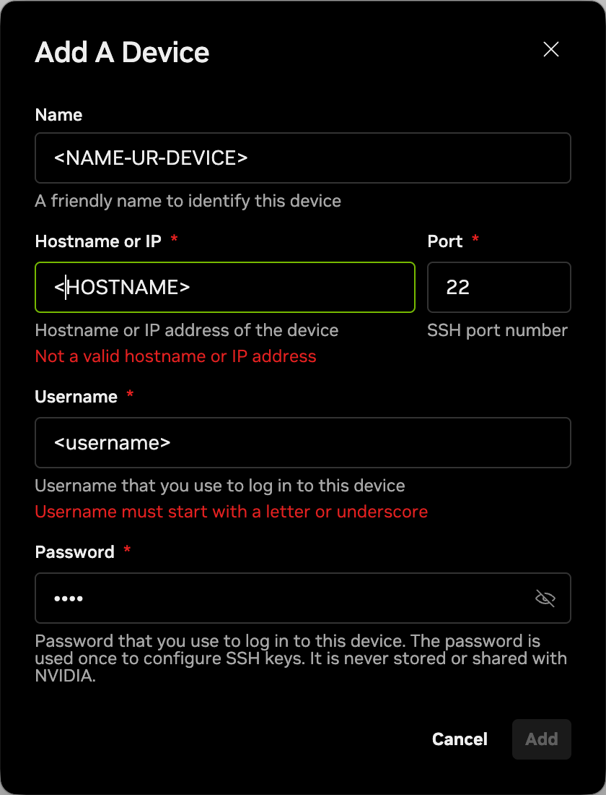
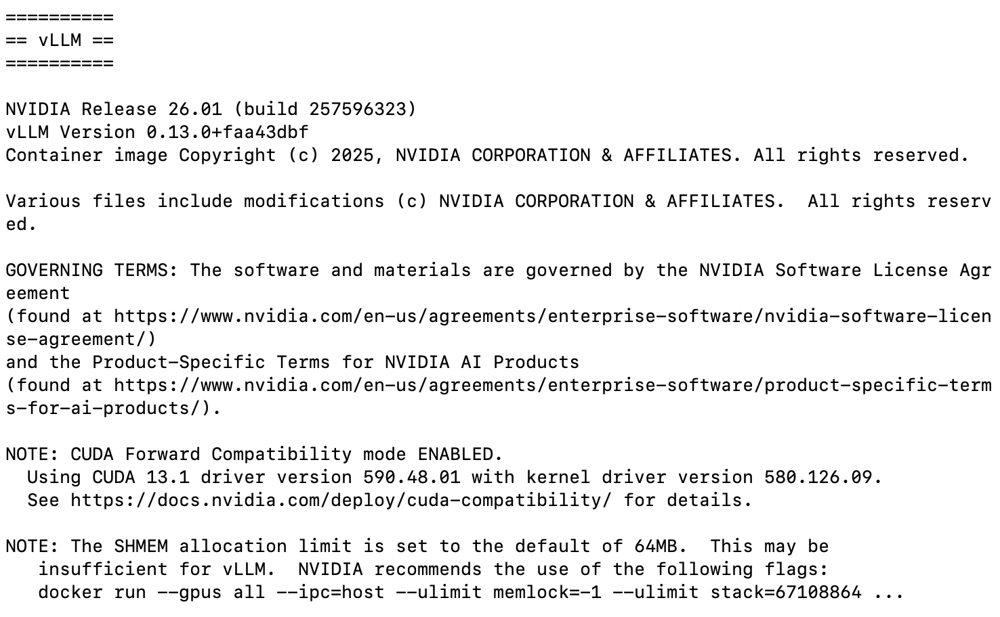

# DGX Spark Cookbook

## Table of Contents

- [x] [Setup Instructions](#setup-instructions)
    - [x] [Headless server](#headless-server)
    - [x] [Proxy Configurations](#proxy-configurations)
    - [ ] Disable GUI https://forums.developer.nvidia.com/t/switching-to-headless-mode/352366
- [ ] [Playbook Examples](#playbook-examples)
    - [ ] [Inference Engine]()
        - [x] [vLLM Deployment](#vllm-deployment)
        - [ ] [SGLang for Inference]()
    - [ ] [Fine-tuning]()
        - [ ] [FLUX.1 Dreambooth LoRA Fine-tuning]()
        - [ ] [Unsloth on DGX Spark]()
    - [ ] [Applications]()
        - [ ] [Text to Knowledge Graph]()
- [ ] [Benchmarks](#benchmarks)
    - [ ] [Our Benchmarks](#our-benchmarks)
    - [ ] Fine-tuning
- [ ] Appendix
    - [ ] Hardware specs https://nvdam.widen.net/s/tlzm8smqjx/workstation-datasheet-dgx-spark-gtc25-spring-nvidia-us-3716899-web

## Setup Instructions

- Prequisite:
    - A monitor
    - A set of mouse/keyboard (USB-TypeC)
    - (If necessary) Ether Net
- NVDIA Official Setup wizard.
    - E.g., Admin account
- Add a new user account
    ```bash
    # Setup your account with sudo priviledge and personal home direcotry
    sudo useradd -m -s /bin/bash -G sudo <username>
    
    # Setup password
    sudo passwd <username>
    ```

### Headless Server

The most appropriate usage for DGX Spark is the headless server. Each team may have dual/multiple stacked DGX Spark and access them using NVSync (SSH Tunnel) similar to bastion servers. In order to do so, there are a few requirements:

- NVSync Configurations. [NVIDIA Sync](https://build.nvidia.com/spark/connect-to-your-spark/sync) is a system tray utility that provides a simple way to access your DGX Spark system remotely from another machine. Whether your DGX Spark is connected to a monitor or not, NVIDIA Sync makes it easy to connect your favorite development tools and access the system from anywhere on your network.
    - Add your device:
    - Hostname of IP can be obtained by running `hostname` in command line.
    

- As NVSync requires your DGX Spark and your personal end are in the same network, WiFi needs to survive over reboot and be system-wide
    ```bash
    # Check autoconnect and permissions options:
    nmcli connection show "<WIFI-SSID>"
    
    # If you donot observe "yes" value in "autoconnect" field:
    sudo nmcli connection modify "<WIFI-SSID>" connection.autoconnect yes
    # If you donot observe "--" value in "permissions" field:
    sudo nmcli connection modify "<WiFi-SSID>" connection.permissions ""
    
    # Test with reboot
    sudo reboot
    ```
- TUI over GUI, once we have made the decision to turn DGX Spark to a headless server, it is only logical to enable TUI over GUI (gnome stuff).

### Proxy Configurations

- CLI proxy config:

    ```bash
    # Set proxy
    export http_proxy="http://<proxy-server>:<proxy-port>"
    export https_proxy="http://<proxy-server>:<proxy-port>"

    # if authentication required
    export http_proxy="http://<username>:<passwd>@<proxy-server>:<proxy-port>"
    ```

- Test

    ```bash
    $ /workspace curl -s www.google.com
    <HTML><HEAD><meta http-equiv="content-type" content="text/html;charset=utf-8">
    <TITLE>302 Moved</TITLE></HEAD><BODY>
    <H1>302 Moved</H1>
    The document has moved
    <A HREF="http://www.google.com.hk/url?sa=p&amp;hl=zh-CN&amp;pref=hkredirect&amp;pval=yes&amp;q=http://www.google.com.hk/&amp;ust=1770950680483704&amp;usg=AOvVaw0aOvjGU7OqYo59FCavkwgl">here</A>.
    </BODY></HTML>
    ```

export http_proxy="http://192.168.3.158:1082"
export https_proxy="http://192.168.3.158:1082"

- docker proxy config: modify `~/.docker/config.json`
    ```json
    {
        "proxies": {
        "default": {
            "httpProxy": "http://proxy.example.com:3128",
            "httpsProxy": "https://proxy.example.com:3129",
            "noProxy": "127.0.0.0"
            }
        }
    }

## Playbook Examples

You can access official DGX Spark Playbook via https://build.nvidia.com/spark. The following examples are demonstrated because a series tweaks are required due to network issues and other sorts.

### vLLM Deployment

This instruction makes a bit tweak to the official [vLLM for Inference](https://build.nvidia.com/spark/vllm/instructions), due to the networking issues and other sorts.

- Add your current user account to docker group
    ```bash
    sudo usermod -aG docker $USER
    newgrp docker
    ```
- Pull official vLLM container image, check the latest version from https://catalog.ngc.nvidia.com/orgs/nvidia/containers/vllm
    ```bash
    export LATEST_VLLM_VERSION=<latest_container_version>
    docker pull nvcr.io/nvidia/vllm:${LATEST_VLLM_VERSION}
    ```
- Now, we are going to branch out with: 1) model installation, 2) model mounting
    - We first download any open-sourced models from HuggingFace to, for example, `~/Workspace/models/Qwen/Qwen2.5-Math-1.5B-Instruct` (note, it doesn't matter where you download the model on your local end).
    - Then, we need to copy the model to DGX Spark by external storage disk or `scp` (or drag and drop in VSCode) in the path `/home/$USER/models/Qwen/Qwen2.5-Math-1.5B-Instruct`.
    - Finally, we need to mount the model to docker and start container accordingly
        ```bash
        docker run -it --gpus all \
               -p 8000:8000 \
               -v $HOME/models:/models \
               nvcr.io/nvidia/vllm:26.01-py3 \
               vllm serve /models/Qwen/Qwen2.5-Math-1.5B-Instruct
        ```
    - You will be able to see the following results
        
    - You should note your models are mounted in root dir, `/models/Qwen/Qwen2.5-Math-1.5B-Instruct`
- Eventually, we can perform inference using vLLM engine:
    ```bash
    # Be aware of the "model" param, it has to match the path where you mount them.
    curl http://localhost:8000/v1/chat/completions \
        -H "Content-Type: application/json" \
        -d '{
            "model": "/models/Qwen/Qwen2.5-Math-1.5B-Instruct",
            "messages": [{"role": "user", "content": "12*17"}],
            "max_tokens": 500
        }'
    ```
- Response
    ```json
    {
        "id":"chatcmpl-a37b293a19692ba7",
        "object":"chat.completion",
        "created":1771039781,
        "model":"/models/Qwen/Qwen2.5-Math-1.5B-Instruct",
        "choices":[
            {
                "index":0,
                "message":
                {
                    "role":"assistant",
                    "content":"To solve \\(12 \\times 17\\), we can use the distributive property of multiplication over addition. Here are the steps:\n\n1. Break down 17 into 10 and 7:\n   \\[\n   12 \\times 17 = 12 \\times (10 + 7)\n \\]\n\n2. Distribute the 12 to both 10 and 7:\n   \\[\n   12 \\times (10 + 7) = 12 \\times 10 + 12 \\times 7\n   \\]\n\n3. Calculate \\(12 \\times 10\\):\n   \\[\n   12 \\times 10 = 120\n   \\]\n\n4. Calculate \\(12 \\times 7\\):\n   \\[\n   12 \\times 7 = 84\n   \\]\n\n5. Add the two results together:\n   \\[\n   120 + 84 = 204\n   \\]\n\nSo, the final answer is \\(\\boxed{204}\\).",
                    "refusal":null,
                    "annotations":null,
                    "audio":null,
                    "function_call":null,
                    "tool_calls":[],
                    "reasoning":null,"reasoning_content":null
                },
                "logprobs":null,
                "finish_reason":"stop",
                "stop_reason":null,
                "token_ids":null
            }
        ],
        "service_tier":null,
        "system_fingerprint":null,
        "usage":
        {
            "prompt_tokens":33,
            "total_tokens":269,
            "completion_tokens":236,
            "prompt_tokens_details":null
        },
        "prompt_logprobs":null,
        "prompt_token_ids":null,
        "kv_transfer_params":null
    }
    ```

## Benchmarks

[NVDIA has released an official benchmark](https://developer.nvidia.com/blog/how-nvidia-dgx-sparks-performance-enables-intensive-ai-tasks/) for different workloads: **Fine-tuning**, **Image generation** and **Inference**.

**Fine-tuning**

| Model  | Method | Backend | Configuration | Peak token/sec |
|:---|:---|:---|:---|:---|
|Llama 3.2 3B|Full fine tuning|PyTorch|Sequence length: 2048<br>Batch size: 8<br>Epoch: 1<br>Steps: 64|13,519.54|
|Llama 3.1 8B|LoRA|PyTorch|Sequence length: 2048<br>Batch size: 4<br>Epoch: 1<br>Steps: 64|6,969.59|
|Llama 3.3 70B|QLoRA|PyTorch|Sequence length: 2048<br>Batch size: 8<br>Epoch: 1<br>Steps: 64|759.79

**Image generation**

|Model|Precision|Backend|Configuration|Images/min|
|:---|:---|:---|:---|:---|
|Flux.1 12B Schnell|FP4|TensorRT|Resolution: 1024×1024<br>Denoising steps: 4 <br>Batch size: 1|23|
|SDXL1.0|BF16|TensorRT|Resolution: 1024×1024<br>Denoising steps: 50<br>Batch size: 2|7

**Inference** (ISL|OSL = 2048|128, BS=1)

|Model|Precision|Backend|Prompt processing throughput<br>(tokens/sec)|Token generation throughput<br>(tokens/sec)|
|:---|:---|:---|:---|:---|
|Qwen3 14B|NVFP4|TRT-LLM|5928.95|22.71|
|GPT-OSS-20B|MXFP4|llama.cpp|3670.42|82.74|
|GPT-OSS-120B|MXFP4|llama.cpp|1725.47|55.37|
|Llama 3.1 8B|NVFP4|TRT-LLM|10256.9|38.65|
|Qwen2.5-VL-7B-Instruct|NVFP4|TRT-LLM|65831.77|41.71|
|Qwen3 235B<br>(on dual DGX Spark)|NVFP4|TRT-LLM|23477.03|11.73|

### Our Benchmarks

**Fine-tuning** is not benchmarked, as the request to LLaMA 3.2 is rejected.
**Image generation** is not benchmarked, as docker image takes 5-6 GiB to pull.

**Inference** is benchmarked as follows.

```sh
llama-bench \
            -m $HOME/models/gpt-oss-mxfp4.gguf \
            -fa 1 \     # enable flash attention
            -t 1  \     # specify thread to be 1
            -b 2048 \   # specify maximized logical batch processed tokens
            -ub 2048 \  # specify maximized physical batch procesed tokens
            -p 512,1024,2048,4096,8192,16384,32678 # specify generation tokens
```

|model|size|params|backend|fa|test|t/s|
|:---|:---|:---|:---|:---|:---|---:|
|gpt-oss 20B MXFP4 MoE|11.27 GiB|20.91 B|CUDA|1|pp512|4154.93 ± 65.62|
|gpt-oss 20B MXFP4 MoE|11.27 GiB|20.91 B|CUDA|1|pp1024|4466.19 ± 15.87|
|gpt-oss 20B MXFP4 MoE|11.27 GiB|20.91 B|CUDA|1|pp2048|4464.13 ± 3.16|
|gpt-oss 20B MXFP4 MoE|11.27 GiB|20.91 B|CUDA|1|pp4096|4441.50 ± 14.76|
|gpt-oss 20B MXFP4 MoE|11.27 GiB|20.91 B|CUDA|1|pp8192|4337.99 ± 14.47|
|gpt-oss 20B MXFP4 MoE|11.27 GiB|20.91 B|CUDA|1|pp16384|4061.96 ± 6.42|
|gpt-oss 20B MXFP4 MoE|11.27 GiB|20.91 B|CUDA|1|pp32678|3494.22 ± 5.34|
|gpt-oss 20B MXFP4 MoE|11.27 GiB|20.91 B|CUDA|1|tg128|83.93 ± 0.15|
|gpt-oss 20B MXFP4 MoE|11.27 GiB|20.91 B|CUDA|1|tg256|83.93 ± 0.09|
|gpt-oss 20B MXFP4 MoE|11.27 GiB|20.91 B|CUDA|1|tg512|83.45 ± 0.05|
|gpt-oss 20B MXFP4 MoE|11.27 GiB|20.91 B|CUDA|1|tg1024|82.96 ± 0.04|
|gpt-oss 20B MXFP4 MoE|11.27 GiB|20.91 B|CUDA|1|tg2048|82.20 ± 0.07|

> **How to interpret this result table**:
> The test starts with prefix pp/tg, as in prompt processing and target generation. And then the following integers represents the number of tokens. Eventually, the last columns simply shows the performance as token per second.
> For example, the test pp512 means processing 512 tokens in a prompt. And tg128 profiles the performance to generate 128 tokens.

It can be seen that the performance is approximately identical to what is advertised in the official benmark. And compared to benchmarks on M3 Ultra (512GB, 80GPU cores) previously done by [@ggerganov](https://github.com/ggerganov) in the discussion [guide : running gpt-oss with llama.cpp](https://github.com/ggml-org/llama.cpp/discussions/15396)

```
model	size	params	backend	n_ubatch	fa	test	t/s
gpt-oss 20B MXFP4 MoE	11.27 GiB	20.91 B	Metal	2048	1	pp2048	2816.47 ± 2.74
gpt-oss 20B MXFP4 MoE	11.27 GiB	20.91 B	Metal	2048	1	pp8192	2308.17 ± 5.98
gpt-oss 20B MXFP4 MoE	11.27 GiB	20.91 B	Metal	2048	1	pp16384	1879.98 ± 1.99
gpt-oss 20B MXFP4 MoE	11.27 GiB	20.91 B	Metal	2048	1	pp32768	1351.67 ± 4.32
gpt-oss 20B MXFP4 MoE	11.27 GiB	20.91 B	Metal	2048	1	tg128	115.52 ± 0.29
```

### GEMM Benchmarks

|Variant|MatrixSize|TimeMean_ms|TimeMin_ms|TimeMax_ms|TFLOPS|MemoryBW_GB_s|MaxError|
|---|---|---|---|---|---|---|---|
|cuBLAS FP32|1024|0.062|0.060|0.067|34.88|204.4|1.45e-02|
|cuBLAS FP16 Tensor Cores|1024|0.034|0.034|0.040|62.64|244.7|1.42e-02|
|cuBLAS BF16 Tensor Cores|1024|0.046|0.034|0.071|47.08|183.9|1.12e-01|
|cuBLAS FP32|2048|0.383|0.374|0.389|44.83|131.3|2.84e-02|
|cuBLAS FP16 Tensor Cores|2048|0.229|0.224|0.235|75.14|146.8|2.73e-02|
|cuBLAS BF16 Tensor Cores|2048|0.254|0.219|0.405|67.51|131.9|1.71e-01|
|cuBLAS FP32|4096|3.272|2.982|4.766|42.00|61.5|5.75e-02|
|cuBLAS FP16 Tensor Cores|4096|1.940|1.753|2.386|70.86|69.2|5.32e-02|
|cuBLAS BF16 Tensor Cores|4096|1.771|1.590|2.094|77.59|75.8|2.52e-01|
|cuBLAS FP32|8192|26.649|24.365|30.112|41.26|30.2|1.59e-01|
|cuBLAS FP16 Tensor Cores|8192|13.224|11.707|14.393|83.15|40.6|1.44e-01|
|cuBLAS BF16 Tensor Cores|8192|12.788|11.363|14.129|85.98|42.0|4.10e-01|
|cuBLAS FP32|16384|383.223|265.305|515.141|22.95|8.4|3.05e-01|
|cuBLAS FP16 Tensor Cores|16384|116.705|100.045|154.634|75.37|18.4|4.84e-01|
|cuBLAS BF16 Tensor Cores|16384|102.876|96.231|127.412|85.50|20.9|8.58e-01|
